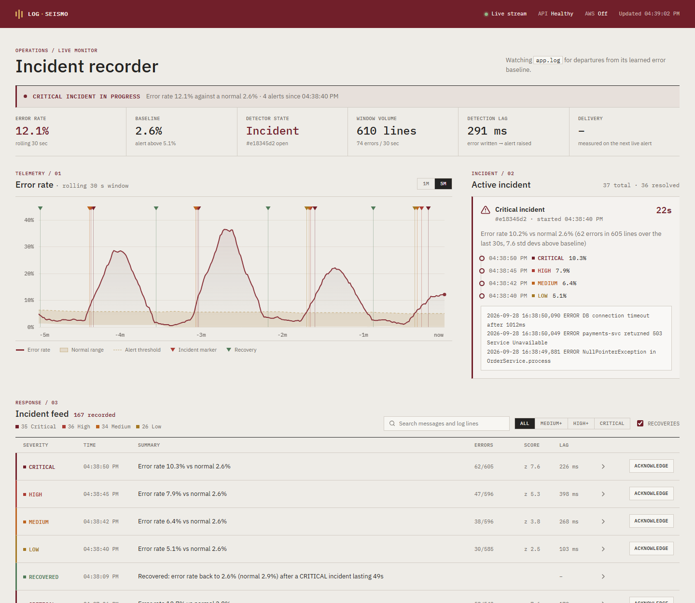

# Log-Seismo: Real-Time Log Anomaly Detector with Alert Feed

Watches a live log file, learns what a normal error rate looks like, and raises severity-graded, **explained** alerts the moment errors spike. Alerts stream to a React dashboard over WebSockets (with REST polling fallback) and are pushed to AWS CloudWatch Logs and SNS.

Focus: **low time from anomaly to alert**. Every alert records its detection lag (error line written → alert raised), and the dashboard shows delivery latency (alert raised → on screen).



## Results at a glance

| | |
|---|---|
| Mean time to detect an incident | **≈ 3.5 s** (benchmark) |
| Detection lag, error line written → alert | **0.1–0.9 s** (live run) |
| Delivery, alert → dashboard | **≈ 5 ms** (WebSocket) |
| Incidents caught under heavy load | **105/105** (original design: 25/105) |
| False alarms, 3 h of normal traffic | **0** |
| Automated tests | 11 (`pytest`) |

## Minimum requirements → where they are

| Requirement | Implementation |
|---|---|
| Monitor a continuously growing log file | [`detector/tailer.py`](detector/tailer.py): follows new lines like `tail -F`, survives rotation and truncation |
| Rolling error rate over a sliding window | [`detector/engine.py`](detector/engine.py): time-based window (default 60 s), evaluated every second |
| Baseline for normal behaviour | Robust warm-up (median/MAD), then a slowly adapting EWMA that learns only from clearly normal periods |
| Detect deviations from the baseline | z-score of the current rate against the learned baseline |
| Severity levels | LOW / MEDIUM / HIGH / CRITICAL at 2.5σ / 3.5σ / 5σ / 7σ, plus a RECOVERED alert |
| Real-time frontend (WebSockets or polling) | [`frontend/src/`](frontend/src/): React, WebSocket `/ws` with automatic REST polling fallback |
| Display alerts as they're generated | Live alert feed, incident banner, alert markers on the chart |
| Push alerts to CloudWatch Logs or SNS | [`backend/aws_publisher.py`](backend/aws_publisher.py): **both**. Every alert goes to CloudWatch Logs; HIGH+ alerts and their recoveries go to SNS |

Beyond the minimum: explained alerts, incident grouping with recovery alerts, alert-flood control, latency measurement, a reproducible benchmark. See [`docs/WORKLOG.md`](docs/WORKLOG.md) for why each design decision was made.

## How it works

Full diagrams and design rationale: [`docs/ARCHITECTURE.md`](docs/ARCHITECTURE.md).

```
log file (keeps growing)
   │  tailer.py      follows new lines, survives rotation/truncation
   ▼
parser.py            line → {timestamp, level, message}
   ▼
engine.py            60 s sliding window → error rate
                     warm-up → baseline (mean, std), then EWMA updates on clearly normal ticks only
                     z = (rate − baseline) / std → LOW / MEDIUM / HIGH / CRITICAL
                     incidents: cooldown, escalation, recovery alert when back to normal
   ▼
backend/app.py       FastAPI; WebSocket /ws + REST polling fallback
   ├──► frontend/ (React)     live chart, incident banner, latency tiles, filterable alert feed
   └──► aws_publisher.py      background queue → CloudWatch Logs (all alerts), SNS (HIGH and above)
```

Severity thresholds (standard deviations above baseline): LOW ≥ 2.5, MEDIUM ≥ 3.5, HIGH ≥ 5, CRITICAL ≥ 7. Alerts are grouped into incidents. Inside an open incident, only an escalation or a fresh spike raises a new alert; a steady incident re-notifies at most every 5 minutes (`RENOTIFY_SEC`), so there's no alert flood. After an incident, once the rate stays normal for `RECOVERY_TICKS` seconds, one recovery alert closes it. The baseline only learns from ticks with z < `ADAPT_MAX_Z` (2.0), so neither an incident nor the elevated ramp around it becomes the new normal.

### Benchmark

`python -m scripts.evaluate` replays synthetic traffic (3% normal errors, incidents of 12–60% for 15–30 s) through the detector, 3 seeds each:

| Setting | Incident every 90 s | Incident every 50 s (heavy load) | False alarms, 3 h normal traffic |
|---|---|---|---|
| Original (α=0.05, learn below z 2.5) | 56/57, 3.7 s to detect | **25/105** covered | 0 |
| Current (α=0.02, learn below z 2.0, robust warm-up) | 57/57, 3.5 s to detect | **105/105** covered (75 with a new alert, 30 inside an already-open incident) | 0 |

With frequent incidents the original baseline drifted upward (to ~19% error rate) and stopped seeing new incidents. "Covered" means that when the incident happened, an alert fired for it or an already-alerted incident was still open.

## Run it

```bash
python -m venv .venv
# Windows: .venv\Scripts\activate    macOS/Linux: source .venv/bin/activate
pip install -r requirements.txt
cp .env.example .env        # Windows: copy .env.example .env
```

Terminal 1, fake log traffic with an incident every 2 minutes:
```bash
python -m generator.log_generator --out logs/app.log --burst-every 120
```

Build the dashboard once (needs Node 18+):
```bash
cd frontend
npm install
npm run build
cd ..
```

Terminal 2, server and dashboard:
```bash
uvicorn backend.app:app --reload
```
Open http://localhost:8000. The baseline takes about a minute to learn, then the first incident appears as an alert.

Working on the dashboard? Run `npm run dev` in `frontend/` and open http://localhost:5173 instead. It hot-reloads and proxies `/api` and `/ws` to the server on :8000.

Detection only, no web server:
```bash
python -m detector.pipeline logs/app.log
```

Tests and benchmark:
```bash
pytest
python -m scripts.evaluate
```

## AWS setup (optional)

1. Create an SNS topic and subscribe your email to it (confirm the email).
2. Configure credentials with `aws configure`, or use env vars. The IAM user needs `logs:CreateLogGroup`, `logs:CreateLogStream`, `logs:PutLogEvents` and `sns:Publish`.
3. In `.env` set `AWS_ENABLED=true` and `SNS_TOPIC_ARN=arn:aws:sns:...`.

The log group and stream are created automatically. With `AWS_ENABLED=false`, alerts are printed as `[mock AWS]` instead.

## Project layout

```
config.py                  settings from .env
generator/log_generator.py fake log traffic with incidents
detector/tailer.py         follow a growing file
detector/parser.py         parse log lines
detector/engine.py         sliding window, baseline, severity
detector/pipeline.py       glue + terminal mode
backend/app.py             FastAPI, WebSocket, REST
backend/aws_publisher.py   CloudWatch + SNS (background queue)
frontend/src/              React dashboard (Vite)
scripts/evaluate.py        offline detection benchmark
tests/                     pytest suite for the engine
docs/ARCHITECTURE.md       diagrams + design rationale
docs/ALERT_SCHEMA.md       message formats shared by all components
docs/WORKLOG.md            what we changed and why, with evidence
docs/PITCH.md              pitch script and judge Q&A
```

## Team split

| | Person A: detection | Person B: delivery | Person C: evaluation |
|---|---|---|---|
| Owns | `generator/`, `detector/`, `tests/` | `backend/`, `frontend/`, AWS setup | `scripts/`, results, report |
| Requirements | monitor growing log, sliding-window rate, baseline, deviation detection, severity | real-time frontend, live alert display, CloudWatch/SNS | latency + detection benchmarks, comparison with baselines |
| Branch | `feature/detection` | `feature/dashboard` | `feature/evaluation` |

Both work against the shared contract in [`docs/ALERT_SCHEMA.md`](docs/ALERT_SCHEMA.md). See [`CONTRIBUTING.md`](CONTRIBUTING.md) for the workflow.
