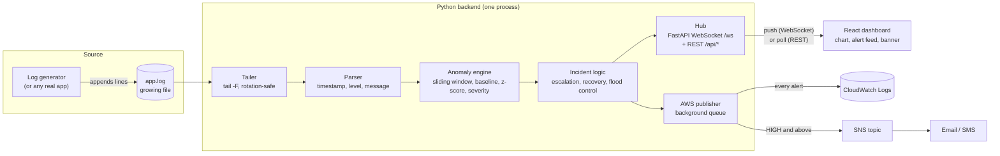
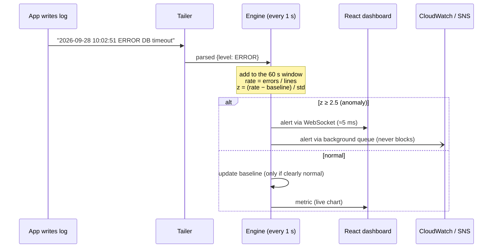
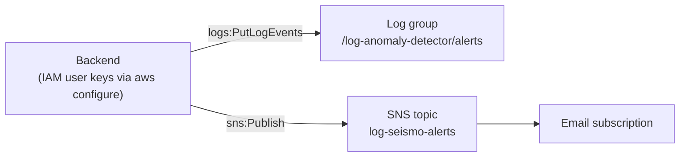

# Architecture

Log-Seismo is one Python process (FastAPI) plus a React single-page app. It has no database and no message broker, and it needs no training.

## System overview

## What happens to one log line

## The detection engine

| Step | What it does | Why |
|---|---|---|
| Sliding window | Keeps the last 60 s of lines; recomputes `error_rate = errors / lines` every second | Rolling rate required by the brief; time-based, so it works at any traffic level |
| Warm-up | First 60 s: baseline = **median** of rates, spread = **MAD** | Median/MAD ignores a burst that happens during start-up |
| Adaptive baseline | EWMA (α = 0.02) updated **only when z < 2** | Follows slow drift, but an incident never becomes the "new normal" |
| Deviation | `z = (rate − baseline) / std` | Scale-free: the same thresholds work for a 1% or a 10% normal rate |
| Severity | LOW ≥ 2.5σ, MEDIUM ≥ 3.5σ, HIGH ≥ 5σ, CRITICAL ≥ 7σ | Graded response; only HIGH+ pages a human via SNS |
| Incidents | Alerts share an `incident_id`; a new alert fires only on escalation or a fresh spike; after 5 normal seconds a RECOVERED alert closes the incident | Prevents alert floods; tells the operator when a problem is over |
| Explanation | Each alert carries a sentence, e.g. "Error rate 12.8% vs normal 3.5% (81 errors in 631 lines…)", plus sample error lines | The operator sees why, not just a score |

## Components and files

| Component | File | Tech |
|---|---|---|
| Log generator (demo data) | `generator/log_generator.py` | Python |
| Tailer | `detector/tailer.py` | Python |
| Parser | `detector/parser.py` | Python regex |
| Engine | `detector/engine.py` | Python stdlib only |
| Pipeline glue | `detector/pipeline.py` | Background thread |
| API + WebSocket | `backend/app.py` | FastAPI, Uvicorn |
| AWS publisher | `backend/aws_publisher.py` | boto3; worker thread + queue |
| Dashboard | `frontend/src/` | React 18, Vite, Canvas chart |
| Config | `config.py`, `.env` | Environment variables |
| Tests / benchmark | `tests/`, `scripts/evaluate.py` | pytest |

## AWS pieces (requirement 8)

- **CloudWatch Logs:** every alert is written as JSON. The log group and stream are created automatically on start-up.
- **SNS:** HIGH/CRITICAL alerts and their recoveries are sent as an email. The subject looks like `[HIGH] Log anomaly detected`.
- Publishing runs on a background thread, so a slow AWS call never delays detection.
- Setup steps: README → "AWS setup".

## Message contract

See [`ALERT_SCHEMA.md`](ALERT_SCHEMA.md) for the exact JSON of alerts, metrics and WebSocket messages.
